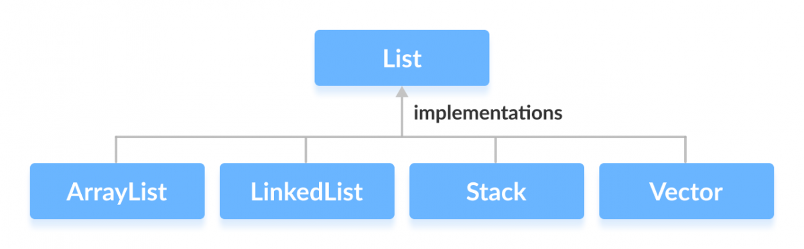

# Interfaces

## Coesão e Acoplamento

Para entender a importância das Interfaces, primeiro precisamos entender o que é **coesão e acoplamento**.

**Coesão** é o grau em que uma classe tem um único e bem focado propósito.
Classes coesas geralmente são enxutas e legíveis.
Uma  consequência disso são classes com poucas funções, e funções fáceis de serem compreendidas.

**Acoplamento** é o grau com que uma classe conhece a outra.
Isso gera dependência, o que é ruim, pois quando uma classe precisa ser alterada isso gera um efeito cascata de alteração de código nas classes dependentes.
Duas formas comum de acoplamentos são a *composição* e a *herança*.

Um dos mantras do desenvolvimento OO é prezar pela **alta coessão e baixo acoplamento**

Note, no entanto, que os sistemas, especialmente aqueles escritos em uma linguagem OO, precisam de relacionamentos.
Os relacionamentos são a base da programação OO, pois os objetos de um programa têm o mesmo comportamento do mundo real: os objetos se relacionam e interagem, provocando mudança de estado no mundo (outros objetos).

Portanto, se os relacionamentos são inevitáveis, o que precisamos buscar é relacionamentos menos suscetíveis a mudanças.
**Relacionamentos estáveis e duradouros**.
E uma das formas de se fazer isto é usando **Interfaces**.

## Interfaces

**Interfaces** são çomo uma espécie de *contrato*.
Elas definem quais funções/métodos devem ser implementadas, mas não especificam como devem ser implementadas.

As interfaces, assim como os contratos, precisam ser minuciosamente pensadas e escritas.
Isto é verdade pois contratos geram fortes vínculos, são difíceis de mudar ou de serem quebrados (pelo menos em teoria).

Vamos examinar uma interface que vocês certamente já usaram até aqui, a [interface List](https://docs.oracle.com/javase/8/docs/api/java/util/List.html).
Aqui estão algumas das funções definidas no contrato de *List*:
- boolean	add(E e): appends the specified element to the end of this list.
- void	add(int index, E element): inserts the specified element at the specified position in this list.
- void	clear(): removes all of the elements from this list.
- boolean	contains(Object o): returns true if this list contains the specified element.
- boolean	equals(Object o): compares the specified object with this list for equality.
- E	get(int index): returns the element at the specified position in this list.
- int	indexOf(Object o): returns the index of the first occurrence of the specified element in this list, or -1 if this list does not contain the element.
- boolean	isEmpty(): returns true if this list contains no elements.
- int	lastIndexOf(Object o): returns the index of the last occurrence of the specified element in this list, or -1 if this list does not contain the element.
- E	remove(int index): removes the element at the specified position in this list.
- boolean	remove(Object o): removes the first occurrence of the specified element from this list, if it is present.
- E	set(int index, E element): replaces the element at the specified position in this list with the specified element.
- int	size(): returns the number of elements in this list.

As classes que implementam as interfaces são ditas classes que assinaram o contrato.
As classes que assinam o contrato devem implementar todos os métodos do contrato, senão estarão quebrando o contrato, e assim o programa não compilará.

 

