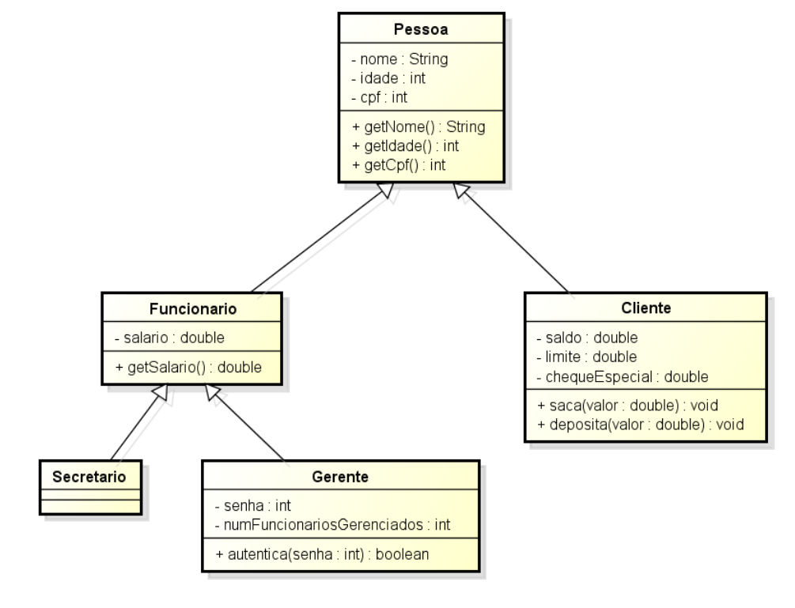

# Polimorfismo

Polis é uma palavra grega que significa *muitas*.
Morfo é outra palavra grega que significa *formas*.
Portanto, *polimorfismo* quer dizer **várias formas**.

Mas como assim, várias formas???
Quem é a entidade que assume várias formas??

## Objetos nascem e morrem sendo de um mesmo tipo!

Bem... Um objeto de um tipo específico A, uma vez criado, ele sempre será do tipo específico A.

```java
class Refeicao{
	String nome, carboidrato, proteina;
	int gramasCarboidrato, gramasProteina, tempoCozimento;
	double preco; 
	
  //construtor e métodos
}

class MainRefeicao{
	public static void main(String [] args){
		Refeicao almoco = new Refeicao("feijão com bife", "feijao", 100, "bife", 80, 30, 10);
		Refeicao jantar = new Refeicao("inhame com ovo", "inhame", 80, "ovo", 40, 15, 7);
	}
}
```

No exemplo acima, instanciamos dois objetos: um almoço e um jantar.
Cada objeto instanciado tem seu próprio espaço bem definido na memória RAM..
Uma representação gráfica desses objetos na memória RAM poderia ser a seguinte:


O objeto que está na posição 37843 da memória é do tipo Refeição.
De forma análoga, o objeto que está na posição 98239 também é do tipo Refeição.
Durante todo o ciclo de vida de um objeto ele jamais muda seu tipo.
Portanto, os objetos na posição de memória 37843 e 98239 serão do tipo Refeição até deixarem de existir (quando forem coletados pelo coletor de lixo da JVM).

## Variáveis de referência podem apontar para objetos de tipos diferentes! 

Embora objetos não mudem de tipo, as *variáveis de referência podem mudar o endereço de memória para onde estão apontando*.
Em outras palavras, variáveis de referência podem apontar para outro objeto diferente do objeto corrente para o qual ela aponta.
A única restrição é que variáveis de referência de um tipo A não apontem para um objeto de referência de um tipo B, se B não for subclasse de A.
Tecnicamente falando, uma variável de referência de um tipo A só pode apontar para um objeto do tipo B *if(B instanceof A)*.

Observem a imagem a seguir:



Esse é um diagrama de classes UML.
Ele representa os relacionamentos entre classes.
As setas contínuas representam um relacionamento de herança.
Neste caso:
 - Funcionário É-UMA Pessoa
 - Gerente É-UM Funcionário
 - Secretário É-UM Funcionário
 - Gerente É-UMA Pessoa (pois Gerente É-UM Funcionário e Funcionário É-UMA Pessoa) 
 - Secretário É-UMA Pessoa (pois Secretário É-UM Funcionário e Funcionário É-UMA Pessoa)
 - Cliente É-UMA Pessoa 


```java
	Pessoa p = new Pessoa("Eduardo", 30, 1);
	Funcionario f = new Funcionario("Danilo", 34, 2, 3500);
	Secretario s = new Secretario("Orlando", 40, 3, 3500);
	Gerente g = new Gerente("Bruna", 45, 4, 5000);
	Cliente c = new Cliente("Catarina", 25, 5, 1000, 200, 0);
```

Em um programa com estes relacionamentos, as seguintes atribuições são seguras:

```java	
	//as seguintes atribuições são
	Pessoa pessoa = p;
	p = f;
	p = s;
	p = g;
	p = c;
```

Essas **atribuições são seguras** pois temos certeza que:
- Funcionário É-UMA Pessoa
- Gerente É-UMA Pessoa (pois Gerente É-UM Funcionário e Funcionário É-UMA Pessoa) 
- Secretário É-UMA Pessoa (pois Secretário É-UM Funcionário e Funcionário É-UMA Pessoa)
- Cliente É-UMA Pessoa 

## Atribuições perigosas e o casting

Existem algumas atribuições que são perigosas.
Elas podem funcionar, ou podem causar um erro de execução.
Para atribuições perigosas, a JVM nos força a fazer um **casting**.

Vamos a um exemplo:

```java
	//por aqui tudo ok
	Pessoa p = new Gerente("Bruna", 45, 4, 5000);
	Gerente g = p;	//não compila, requer o casting
```

Embora saibamos que Bruna é Gerente, a atribuição de um objeto que certamente é Pessoa a uma variável de referência do tipo Gerente é perigosa, pois esta Pessoa poderia ser um Secretário, ou poderia ser um Cliente.
Neste caso, para fazer compilar, basta adicionar o casting.

```java
	Pessoa p = new Gerente("Bruna", 45, 4, 5000);
	Gerente g = (Gerente) p;	
```

A seguir mostramos um código que compila mas que apresenta erro de execução:

```java
	//por aqui tudo ok
	Pessoa p = new Cliente("Catarina", 25, 5, 1000, 200, 0);
	Gerente g = (Gerente) p;	//compila, mas lança exceção na execução	
```

Embora o programador tenha avisado à JVM que está ciente da atribuição perigosa, ele não tomou todos os cuidados.
Esta falta de cuidado resultou em uma exceção do tipo *ClassCastException*, que é não-checada por ser facilmente corrigida com um condicional if.

```java
	//por aqui tudo ok
	Pessoa p = new Cliente("Catarina", 25, 5, 1000, 200, 0);
	if(p instanceof Gerente)
		Gerente g = (Gerente) p;	//compila e não lança exceção (pois nao entra no if)
```
